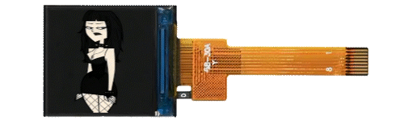

<h1 style="margin-bottom:0;">Shego75HE</h1>
<h4 style="margin-top:0;">Probably the first magnetic keyboard running QMK firmware.</h4>


### Introduction&nbsp; 


I couldn't find a keyboard with the all of features that I wanted at all, so I resorted to building my own one. After testing a lot of keyboards, I wanted one that had a mix of all different features from multiple keyboards. This project has taken many, many, many months, starting from experimentaion and various mini protypes like the [Shego16](https://github.com/Charading/SHEGO16-QMK-Hall-Effect-Macropad)

### Design and Inspiration 💡
I think the exploded 75% layout is one of the best layouts but sadly it's not as aftermarket as the generic 60% layout so my only options for trying to find a board were scarce. For aesthetics, I went with Shego because my mind was blank and tbh, I just wanted a cool silkscreen too lol. 


I do love the **Ajazz AK820 Pro** and it's clean design, along with the added screen. I do wish it could run QMK/VIA firmware though. Another board I tested was the **GamaKay TK75HEV2** I wanted my board to be quite similar to both, but 

<p></p>
Features I wanted

* Hall Sensors
* SOCD
* Rapid Trigger
* Volume Knob
* Ambient Lighting
* Screen
* North-facing RGB
* 75% Layout
* QMK/VIA Compatible
* Works with SignalRGB (per-key not that stupid one-zone nonsense)

#### Firmware 👨‍💻
I originally tried raw C, then riskable put me on Rust, but after creating a successful prototype, I had a revelation. the idea I had is to use normal QMK firmware since I was a little bit familiar with it, then heavily modify my clone of it to work with hall sensors. 

*I am still designing a drop in [module](https://github.com/Charading/qmk-hallscan) that can make anyone be able to use the logic for QMK. Project is ongoing*

Oh yeah, to make my life easier, and save my poor fingers from typing `qmk compile -kb shego75_v1 -km default` a million times, I developed a VS Code extension, a small one-click button that compiles QMK firmware. Find it [here](https://github.com/Charading/QMK-Compile-button-for-VS-Code).

The ESP32 portion is written in C++ inside Arduino IDE.

###### The Sensors 🧲
After doing extensive research and testing with breadboards and Raspberry Pi Pico boards, I settled on using the RP2040 for my base MCU. I was going to use HC4067s, but I didn't really understand multiplexer cascading so after looking for a bit, I stumbled upon the ADG732 so I now use three of these, which means I do not need to use a MCP3208 external ADC *(my god, I recently was trying to get this to work using my sensor-to-matrix logic in QMK but couldn't for the life of me)* and I could use only 3 of the 4 analog pins.

###### How it works 🔎
Essentially, the bread and butter is that the firmware scans across three ADG732 muxes - *which I got really cheap for ~£2 on AliExpress*, and this 'injects' keypresses directly into the key matrix so that it works with VIA and key remapping also. 

On startup, the sensors calibrate with a baseline threshold and when the sensors deviate by a certain % amount, the keypress is registered. I even added hysteresis so I have some kind of rapid trigger.

<p></p>
Debugging keycodes enable printing to QMK Toolbox's HID Console

* `DEBUG_ADC`  - Prints ADC values
* `DEBUG_KEYS` - Prints on keypress events
* `DEBUG_RAW`  - Prints the raw VIA keycode on keypresses, i.e *0x67*

I believe it still prints keys and raw to the screen on a little popup text box too.

###### The Lighting 💡
For the lighting, I ket it simple, and just use SignalRGB,  but in the future I want to maybe add OpenRGB support as well and my own custom lighting section in my Electron app. I have made the [plugin](SignalRGB/SHEGO75.js).

It has full per-key north-facing rgb, a 10-led ambient strip and a 3-led status bar, there is also a 3-pin jst 1.25mm connector footprint in the corner for optional extending *(maybe for a future case, underglow?)*.

The SRGB plugin uses `LedGroups()` to create segments so it has three draggable windows to mess around with.

```javascript
export function LedGroups() {
	return [
		{ name: "Keys",    leds: vKeys },
		{ name: "Ambient", leds: vAmbientKeys },
		{ name: "Status", leds: vStatusKeys }
	];
}
```
 It is designed as one continuous strip though, on `GP17`, but there is a transistor pair on `GP23` which is controlled by the `LED_TOG` custom keycode. 

 When focused on the screen/layer 3 toggled, the status bar will turn blue.

 When debugging is enabled via `DEBUG_ADC`,`DEBUG_KEYS` or `DEBUG_RAW`, the ambient strip should marque orange.

###### The Screen 📺

Sadly, I couldn't figure out how to get SPI working to talk to the screen for GIF upload and playback via HID, so I approached it a different way.

I built an isolated ESP32 system using [my fork](/esp32_display) of a GIF player repo. I basically redid it to have a little menu and file system, and work a different way to the original. Instead of it automatically copying the GIF to flash and autoplaying, I can browse the SD card, choose which GIF to display, it copies it to SPIFFS, then plays. This way it persists even after power off. 

The screen is [this](https://www.aliexpress.com/item/1005004490846551.html) ST7735/GC9107 8-pin, 0.85", 128x128 IPS display.



To get the QMK firmware to communicate with the ESP32 system, I created custom VIA keycodes which send UART text strings and text commands such as `MENU_OPEN`, `MENU_UP`,`MENU_DOWN` and `MENU_SELECT` allow me to navigate and choose an animation.

4-stage PWM controlled backlight with `TFT_BRIGHTNESS_UP` and `TFT_BRIGHTNESS_DOWN`, via a [AO3401](https://www.aosmd.com/res/data_sheets/AO3401.pdf) transistor. 

I also made a a timer page, settings page, and hardcoded focus toggle which layer 3 + encoder press turns the rotation into menu navigation, and press is the select. 

In a small update, I added a I2C connection between the RP2040 and the ESP32 which I was thinking I could use for GIF passthrough and sending in the future but this is not implemented yet.

##### Firmware Issues
I want a way to use QMK's `raw_hid_receive` and `raw_hid_send` so I can have my own custom software that can change per-key actuation, I could implement DKS, upload GIFs to the SD card/directly to the screen and even manage the card's storage. 

I managed to create a small Electron app that can communicate with the board, but it's still in development.

I realised that SignalRGB consumes packets so I had to edit the `signalrgb.c` and `signalrgb.h` to not drop packets it doesn't recognise but I am still stuck because I can't get my app to even toggle GPIO23 which toggles power to the lighting. *I did manage to do it once but I reverted back because I have up, but this was before I changed the SRGB module. Now even with SRGB disabled, I still can't get my keyboard to toggle and I don't know what the issue is.

I just want to be able to talk to my board over HID and then I can make it similar to all those Chinese OEM clone web apps and software, Wootings web app etc.

If anyone more knowledgable can assist or point me in the right direction that would be amazing!


####  Case ⚫


At the moment I am using a prototype case that I printed out of ELEGOO PLA-CF. I could technically get this machined by JLCCNC but I do not wish to increase spending. I would rather wait and see if I can finalise my case beforehand to minimise revisions. 

I do wish I could find the smaller form factor ball catches that the **Lucky65** and many other newer boards use but I can't find somewhere that can machine them or find them aftermarket. So at the moment, it is a two piece design, designed similarily to the **CIDOO C75** and **TK75HEV2** but with the shaping somewhat resembling the **Tofu65** because I like the sharp edges. I really hate the designs that have such baby rounded edges like the **AK820 Pro MAX**.

It uses a daughterboard I designed, but maybe a future design I would want to to use pogo pin connectors like the **Lucky65 V3** but I would have to do some testing to see that the magnetics do not interfer with normal keyboard function.


#### PCB 🟢


Just used KiCad, I kept having issues using the standalone ESP32-PICO-D4 and flashing it *(maybe it's because I was lazy and didn't implement a USB-UART chip)* so I did some looking and found the [TinyPICO Nano](https://github.com/tinypico) to help test with firmware and stuff, just to be safe I moved designed [this adapter](https://github.com/Charading/flexypin_adapters_hw/tree/main/TinyPICO-NANO_flexypin) so interfacing would be easier. `GP0` and `GP1` are broken out for UART0 debug.

### Future Updates/Roadmap 🚗
- I haven't really been focused on it much with this board, but I would be looking to implenting tri-mode or at least 2.4GHz wireless with a dongle. For a future project I want to design a drop in replacement pcb for the **Lucky65 V2** or **Lucky65 V3** running my custom magnetic QMK firmware.

- Software/web app (most likely Electron powered)
- Implement GIF upload over USB 
- Motion design/3D design for promotional material, a small website as I would like to start a small store that sells keyboard stuff and keycaps.
- Full aluminium case needs to be machined 
- Maybe start a Kickstarter for a future keyboard project
- TMR keyboard maybe? 👀


>*I should say I came into this project with no prior knowledge of PCB design (proficient now), very miniscule coding knowledge (still a newbie though), and a small amount of CAD skill (which I am quite proficient at now I believe). My soldering skills are now extremely high as well* :).

### Special Thanks 🖤
- [**riskable**](https://github.com/riskable) for his online resources and availabilty to help me at various points in this project!

- **@hardbr** *(discord)* for helping me understand SignalRGB implentation

- [**Phils Lab**](https://github.com/pms67) for online resources *(Youtube)*

- **JLCPCB**

- **GitHub Copilot**, **ChatGPT**, **Claude**, **Gemini Pro** (actual life savers lmao)

