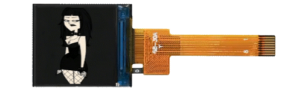

<h1 style="margin-bottom:0;">Shego75HE</h1>
<h4 style="margin-top:0;">Probably the first magnetic keyboard running QMK firmware.</h4>

> 📖 **[Read the latest update →](UPDATE.md)**


### Introduction&nbsp; 


I couldn't find a keyboard with the all of features that I wanted at all, so I resorted to building my own one. After testing a lot of keyboards, I wanted one that had a mix of all different features from multiple keyboards. This project has taken many, many, many months, starting from experimentaion and various mini protypes like the [Shego16](https://github.com/Charading/SHEGO16-QMK-Hall-Effect-Macropad).

### Design and Inspiration 💡
I think the exploded 75% layout is one of the best layouts but sadly it's not as aftermarket as the generic 60% layout so my only options for trying to find a board were scarce. For aesthetics, I went with Shego because my mind was blank and tbh, I just wanted a cool silkscreen too lol. 


I do love the **Ajazz AK820 Pro** and it's clean design, along with the added screen. I do wish it could run QMK/VIA firmware though. Another board I tested was the **GamaKay TK75HEV2** I wanted my board to be quite similar to both, but have everything I've ever wanted. 

<p></p>
Features I wanted

* Hall Sensors
* SOCD
* Rapid Trigger
* Volume Knob
* Ambient Lighting
* Screen
* North-facing RGB
* 75% Layout
* QMK/VIA Compatible
* Works with SignalRGB (per-key not that stupid one-zone nonsense)

#### Firmware 👨‍💻
I originally tried raw C, then riskable put me on Rust, but after creating a successful prototype, I had a revelation. the idea I had is to use normal QMK firmware since I was a little bit familiar with it, then heavily modify my clone of it to work with hall sensors. 

*I am still designing a drop in [module](https://github.com/Charading/qmk-hallscan) that can make anyone be able to use the logic for QMK. Project is ongoing*

Oh yeah, to make my life easier, and save my poor fingers from typing `qmk compile -kb shego75_v1 -km default` a million times, I developed a VS Code extension, a small one-click button that compiles QMK firmware. Find it [here](https://github.com/Charading/QMK-Compile-button-for-VS-Code).

The screen/ESP32 portion is written in C++ inside Arduino IDE.

###### The Sensors 🧲
After doing extensive research and testing with breadboards and Raspberry Pi Pico boards, I settled on using the RP2040 for my base MCU. I was going to use HC4067s, but I didn't really understand multiplexer cascading so after looking for a bit, I stumbled upon the ADG732 so I now use three of these, which means I do not need to use a MCP3208 external ADC *(my god, I recently was trying to get this to work using my sensor-to-matrix logic in QMK but couldn't for the life of me)* and I could use only 3 of the 4 analog pins.

###### How it works 🔎
Essentially, the bread and butter is that the firmware scans across three ADG732 muxes - *which I got really cheap for ~£2 on AliExpress*, and this 'injects' keypresses directly into the key matrix so that it works with VIA and key remapping also. 

On startup, the sensors calibrate with a baseline threshold and when the sensors deviate by a certain % amount, the keypress is registered. I even added hysteresis so I have some kind of rapid trigger.

<p></p>
Debugging keycodes enable printing to QMK Toolbox's HID Console

* `DEBUG_ADC`  - Prints ADC values
* `DEBUG_KEYS` - Prints on keypress events
* `DEBUG_RAW`  - Prints the raw VIA keycode on keypresses, i.e *0x67*

I believe it still prints keys and raw to the screen on a little popup text box too.

###### The Lighting 💡
For the lighting, I ket it simple, and just use SignalRGB,  but in the future I want to maybe add OpenRGB support as well and my own custom lighting section in my Electron app. I have made the [plugin](SignalRGB/SHEGO75.js).

It has full per-key north-facing rgb, a 10-led ambient strip and a 3-led status bar, there is also a 3-pin jst 1.25mm connector footprint in the corner for optional extending *(maybe for a future case, underglow?)*.

The SRGB plugin uses `LedGroups()` to create segments so it has three draggable windows to mess around with.

```javascript
export function LedGroups() {
	return [
		{ name: "Keys",    leds: vKeys },
		{ name: "Ambient", leds: vAmbientKeys },
		{ name: "Status", leds: vStatusKeys }
	];
}
```
 It is designed as one continuous strip though, on `GP17`, but there is a transistor pair on `GP23` which is controlled by the `LED_TOG` custom keycode and cuts power to the LEDs.

 When focused on the screen/layer 3 toggled, the status bar will turn blue.

 When debugging is enabled via `DEBUG_ADC`,`DEBUG_KEYS` or `DEBUG_RAW`, the ambient strip should marque orange.

###### The Screen 📺

Sadly, I couldn't figure out how to get SPI working to talk to the screen for GIF upload and playback via HID, so I approached it a different way.

I built an isolated ESP32 system using [my fork](/esp32_display) of a GIF player repo. I basically redid it to have a little menu and file system, and work a different way to the original. Instead of it automatically copying the GIF to flash and autoplaying, I can browse the SD card, choose which GIF to display, it copies it to SPIFFS, then plays. This way it persists even after power off. 

The screen is [this](https://www.aliexpress.com/item/1005004490846551.html) ST7735/GC9107 8-pin, 0.85", 128x128 IPS display.



To get the QMK firmware to communicate with the ESP32 system, I created custom VIA keycodes which send UART text strings and text commands such as `MENU_OPEN`, `MENU_UP`,`MENU_DOWN` and `MENU_SELECT` allow me to navigate and choose an animation.

4-stage PWM controlled backlight with `TFT_BRIGHTNESS_UP` and `TFT_BRIGHTNESS_DOWN`, via a [AO3401](https://www.aosmd.com/res/data_sheets/AO3401.pdf) transistor. 

I also made a a timer page, settings page, and hardcoded focus toggle which layer 3 + encoder press turns the rotation into menu navigation, and press is the select. 

In a small update, I added a I2C connection between the RP2040 and the ESP32 which I was thinking I could use for GIF passthrough and sending in the future but this is not implemented yet.

##### Firmware Issues
I want a way to use QMK's `raw_hid_receive` and `raw_hid_send` so I can have my own custom software that can change per-key actuation, I could implement DKS, upload GIFs to the SD card/directly to the screen and even manage the card's storage. 

I managed to create a small Electron app that can communicate with the board, but it's still in development.

I realised that SignalRGB consumes packets so I had to edit the `signalrgb.c` and `signalrgb.h` to not drop packets it doesn't recognise but I am still stuck because I can't get my app to even toggle GPIO23 which toggles power to the lighting. *I did manage to do it once but I reverted back because I have up, but this was before I changed the SRGB module. Now even with SRGB disabled, I still can't get my keyboard to toggle and I don't know what the issue is.*

I just want to be able to talk to my board over HID and then I can make it similar to all those Chinese OEM clone web apps and software, Wootings web app etc.

If anyone more knowledgable can assist or point me in the right direction that would be amazing!


####  Case ⚫


At the moment I am using a prototype case that I printed out of ELEGOO PLA-CF. I could technically get this machined by JLCCNC but I do not wish to increase spending at this time. I would rather wait and see if I can finalise my case beforehand to minimise revisions and metallic waste. 

I do wish I could find the smaller form factor ball catches that the **Lucky65** and many other newer boards use but I can't find somewhere that can machine them or find them aftermarket. So at the moment, it is a two piece design, designed similarily to the **CIDOO C75** and **TK75HEV2** but with the shaping somewhat resembling the **Tofu65** because I like the sharp edges. I really hate the designs that have such baby rounded edges like the **AK820 Pro MAX**.

It uses a daughterboard I designed, but maybe a future design I would want to to use pogo pin connectors like the **Lucky65 V3** but I would have to do some testing to see that the magnets do not interfer with normal keyboard function.


#### PCB 🟢


Just used KiCad, I kept having issues using the standalone ESP32-PICO-D4 and flashing it *(maybe it's because I was lazy and didn't implement a USB-UART chip)* so I did some looking and found the [TinyPICO Nano](https://github.com/tinypico). To help test with firmware and stuff, just to be safe and not rely on my firmware working with it just because it worked on the ESP32-WROOM-32 dev module, I designed [this adapter](https://github.com/Charading/flexypin_adapters_hw/tree/main/TinyPICO-NANO_flexypin) so interfacing and testing would be easier. The RP2040's `GP0` and `GP1` are broken out for UART0 debug.

### Future Updates/Roadmap 🚗
- I haven't really been focused on it much with this board, but I will be looking to implent tri-mode or at least 2.4GHz wireless with a dongle. For a coming soon, future project I want to design a drop in replacement pcb for the **Lucky65 V2** or **Lucky65 V3** running my custom magnetic QMK firmware because the cases are gorgeous and such a steal!

- Software/web app (most likely Electron powered)
- Implement GIF upload over USB 
- Motion design/3D design for promotional material, a small website as I would like to start a small store that sells keyboard stuff and keycaps.
- Full aluminium case needs to be machined 
- Maybe start a Kickstarter for a future keyboard project
- TMR keyboard maybe? 👀


>*I should say I came into this project with no prior knowledge of PCB design (proficient now), very miniscule coding knowledge (still a newbie though), and a small amount of CAD skill (which I am quite proficient at now I believe). My soldering skills are now extremely high as well* :).

### Special Thanks 🖤
- [**riskable**](https://github.com/riskable) for his online resources and availabilty to help me at various points in this project!

- **@hardbr** *(discord)* for helping me understand SignalRGB implentation

- [**Phils Lab**](https://github.com/pms67) for online resources *(Youtube)*

- **JLCPCB**

- **GitHub Copilot**, **ChatGPT**, **Claude**, **Gemini Pro** (actual life savers lmao)


## 24/12/2025 - Merry Christmas! 
## Huge Update:
I’ve got the software working and a completely new firmware stack built from the ground up. The app is **Electron-based** and (honestly) was mostly vibe-coded while I iterated on UX and device behavior. The firmware is also brand new—written specifically for this project and its multi‑MCU architecture.

A big part of this update is that we **moved fully away from QMK**. Instead of adapting QMK to fit the hardware and features, we started from scratch with a firmware designed around our exact data paths and performance goals: **USB HID on the RP2040**, a clean **UART link** to the ESP32 for UI/display responsibilities, and **SPI** for high-throughput TFT updates. Dropping QMK gave us tighter control over timing, memory, and feature integration, and removed the friction of forcing a general-purpose keyboard firmware into a system that’s doing more than “just key scanning.”

The project is currently in a private repo. If you want to follow along or chat about it, my Discord is **hyupdo**.

### App Preview

<h5 align="center">Keys</h5>


<h5 align="center">Lighting</h5>


<h5 align="center">Performance</h5>


<h5 align="center" style="margin-bottom: 0;">Screen</h5>

<div align="center" style="font-style: italic; line-height: 1;">
  <small>This feature is only available on the Shego75</small>
</div>


<div align="center" style="line-height: 2;">
  <small>Storage system using the SD ('Send to SD' yet to be implemented)</small>
</div>


### How to use:

#### Keys

Configure per-key actuation points, dead zones, and key assignments. The live visualization shows real-time magnetic sensor readings and key states. Customize individual key behavior with adjustable sensitivity ranges and enable anti-ghosting features. Export and import key profiles for quick configuration switching.

#### Lighting

In the **Lighting** tab, effects are driven using **SignalRGB**, which treats the keyboard like an addressable LED device and streams color data in real time. Once enabled, SignalRGB can take control of animations (audio-reactive, game integrations, ambient effects) and push them directly to the board so lighting stays perfectly in sync with the rest of your setup. You can still fine-tune how the device presents itself to SignalRGB—especially how LEDs are grouped and mapped—so the software knows what “keys” or regions it’s actually driving.

To change **zones**, use the zone controls to assign LEDs/keys into separate regions (for example: left half, right half, underglow, indicator cluster, or per-row groups). Each zone can be adjusted independently so you can apply different colors/effects per region, or scale brightness and effect intensity where you want it. After updating zone assignments, apply/save the configuration so the device reports the new layout and SignalRGB (or the app’s built-in effects) will target the updated zones correctly.

#### Performance

The **Performance** tab is a live “health dashboard” for the firmware and transport links, meant to answer one question quickly: *is the device keeping up in real time?* It aggregates timing, throughput, and workload counters so you can confirm that input scanning, lighting updates, and display/UI work are all completing within budget—especially when features are enabled simultaneously.

At a high level, the tab focuses on three areas:

1) **Frame / Loop Timing**
- Shows how long the main firmware loop (or “frame”) takes to run and how consistent it is over time.
- Look for **average**, **min/max**, and **spike** behavior. A stable system has tight variance; frequent spikes suggest something occasionally blocks (heavy rendering, long SPI transfers, or bursts of host traffic).
- If you see a “budget” or target interval, the goal is to keep the loop time comfortably below that target so there’s slack for bursts.

2) **Input Responsiveness**
- Tracks the cadence and workload of key scanning and event processing.
- Useful indicators include scan rate, event queue depth, and any dropped/late events.
- If responsiveness metrics degrade while other features are active, it’s a sign you should reduce background load (very high LED update rates, overly frequent display refresh, or excessive logging/telemetry).

3) **Transport + Subsystem Throughput (Host ⇄ RP2040 ⇄ ESP32 ⇄ TFT)**
- **USB/HID**: lets you see how often the host is sending commands and how quickly the device is responding. Excessive command rates can create overhead and jitter.
- **UART (RP2040 ⇄ ESP32)**: shows whether messages are flowing smoothly between MCUs. Watch for rising queue/backlog counters or retry/error counts—those often correlate with delayed UI updates.
- **SPI (ESP32 ⇄ TFT)**: large, frequent screen updates can dominate time. If you see display-related counters tied to spikes, consider lowering refresh frequency or reducing what’s being redrawn per update.

How to use it in practice:
- Start with everything “idle” and note the baseline loop time and stability.
- Enable one feature at a time (lighting effects, animations, screen updates, host polling) and watch what changes.
- If a metric provides “worst” or “spike” values, treat those as the most important—single long stalls are often more noticeable than a slightly higher average.
- Use the tab as a verification step after configuration changes: if you adjust lighting zones, increase effect complexity, or change display behavior, confirm the loop remains stable and queues don’t grow over time.

If the Performance tab includes error counters (CRC, framing, dropped packets, overflow), any value that steadily increases during normal use usually indicates a configuration or bandwidth issue worth addressing before it impacts responsiveness.

#### Screen

The screen is driven as a simple “remote display” in a two‑MCU chain: the **RP2040** acts as the USB/HID-facing coordinator, and the **ESP32** acts as the display/UI controller. The RP2040 collects system state (and any stats it owns), then sends compact status packets over **UART** to the ESP32. The ESP32 turns those packets into UI state (text, graphs, icons, warnings) and renders the result to the TFT over **SPI**.

**Communication path**
- **Host → RP2040 (USB HID):** the desktop app can request status, enable/disable telemetry, or change what the UI should show (page selection, refresh rate, debug toggles).
- **RP2040 → ESP32 (UART):** the RP2040 forwards the “what to display” information as structured messages (think: page id + key/value metrics + flags). UART is used because it’s reliable, low-latency, and keeps the display work off the RP2040’s timing-critical loop.
- **ESP32 → TFT (SPI):** the ESP32 updates the actual pixels. SPI is a high-throughput link commonly used by small TFTs, and it lets the ESP32 push either partial updates (only what changed) or full frames depending on the UI.

**How it shows “memory and stuff”**
What you see on the screen is ultimately just the ESP32 drawing primitives (text, lines, rectangles, images) based on numbers it receives. Those numbers can come from a few places:
- **ESP32-local stats:** free heap/PSRAM, task runtime, Wi‑Fi state, frame time for rendering, SPI throughput, queue depths. These are measured directly on the ESP32 and then displayed immediately.
- **RP2040 stats:** loop timing, scan workload, HID traffic counters, UART throughput/error counters. The RP2040 measures these and periodically ships them to the ESP32 so they appear in the same UI.
- **Derived/aggregated values:** rates and percentages (e.g., “updates per second”, “max spike”, “avg frame time”) computed from counters over a time window to make the data readable at a glance.

**Display model (why it can update smoothly)**
- The ESP32 keeps a small UI state model (current page, last-known metric values, thresholds, formatting).
- On each update tick, it compares new values to the previous ones and redraws only the regions that changed (e.g., a number field or a graph strip). This avoids pushing a full-screen refresh over SPI when it’s not needed.
- Graphs are typically rendered as rolling plots: the ESP32 stores a short history buffer (last N samples) and draws it as a line or bar chart, which makes “performance” data intuitive without flooding the link.

**Features the screen typically supports**
- **Pages / tabs:** status overview, lighting status, performance graphs, debug info, connectivity.
- **Live counters:** loop/frame time, HID packet rate, UART rate, dropped/overflow counts.
- **Memory readouts:** free heap/PSRAM (ESP32), and any reported RP2040 memory stats if exposed.
- **Warnings:** threshold-based indicators (e.g., queue growing, repeated UART errors, refresh budget exceeded).

In short: the RP2040 and ESP32 exchange lightweight telemetry over UART, and the ESP32 turns that telemetry into a responsive on-screen dashboard by drawing UI elements over SPI to the TFT.


### App Flow

#### The way it works:


##### Software
The desktop-side software is the user interface and configuration layer. It connects to the device over **USB HID**, provides a way to change settings (layouts, lighting, display options, etc.), and then sends those changes as compact commands to the firmware. Because it uses HID, it can talk to the device without needing a custom driver on most systems, and it can also be used for debugging/telemetry (reading back status, firmware info, and error codes).

##### RP2040
The RP2040 is the **USB-facing controller** and the central coordinator. It presents itself to the computer as a **HID device**, parses incoming configuration commands from the software, and applies settings that belong on the main MCU (key scanning, state management, timing, etc.). It also acts as a bridge to the secondary MCU over **UART**, forwarding display/network-related commands and receiving status updates so the host can see what the rest of the system is doing.

##### ESP32-PICO-D4
The ESP32-PICO-D4 is responsible for the **high-level peripheral side**, primarily driving the display. It receives messages from the RP2040 over **UART**, interprets them as UI/state updates, and renders to the TFT over **SPI**. It can also be used for features that fit better on the ESP32 (background tasks, connectivity, asset handling), while keeping the RP2040 focused on deterministic USB + input timing.


### Test for yourself
I have put the app up online if you want to browse through, WebHID isn't implemented properly since I primarily focused on USB HID but do check out the themes in the Settings tab!

Link: [nova-8tt.pages.dev](https://nova-8tt.pages.dev)


